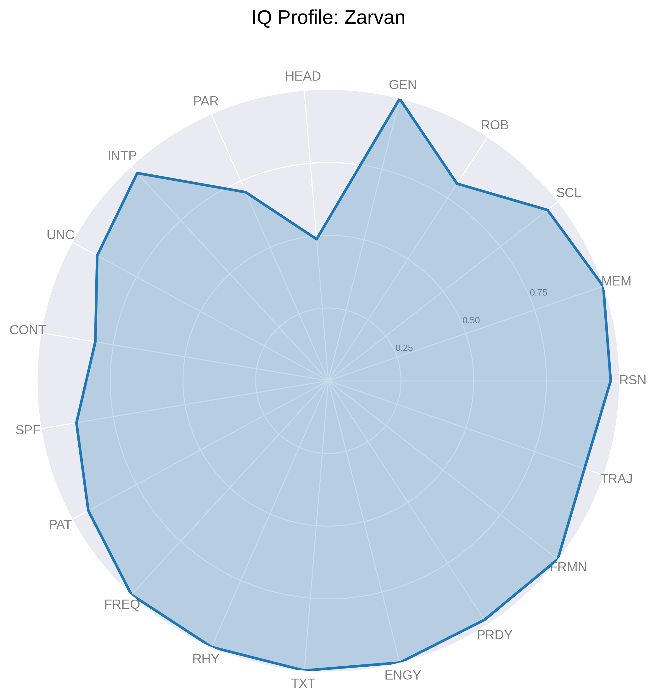
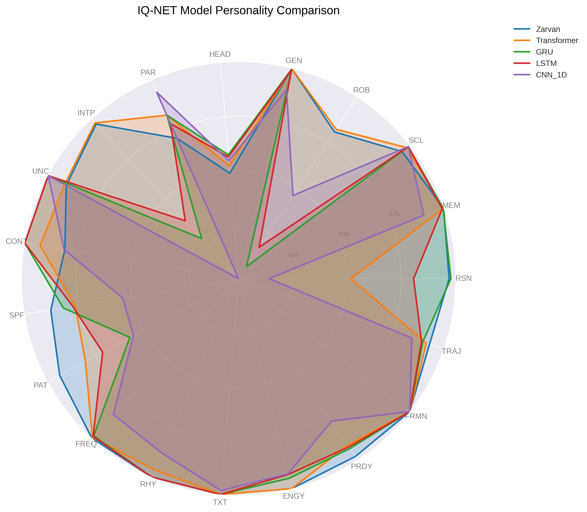

# IQ-NET: A Holistic Aptitude Profiler for Neural Network Architectures

[](https://opensource.org/licenses/MIT)
[](https://www.python.org/downloads/release/python-380/)
[](https://www.preprints.org/manuscript/202507.2512/v1)

**IQ-NET** is a lightweight, rapid, and comprehensive framework for profiling the intrinsic capabilities of neural network architectures. Unlike traditional benchmarks that focus on single-task performance and require extensive GPU resources, IQ-NET evaluates models across **19 theoretically grounded metrics** in minutes using synthetic probe tasks. It spans text, image, audio, and video domains, revealing each model's unique "personality profile" through vivid radar charts. This project empowers researchers to select task-optimal models, identify improvement areas, and drive architectural innovation.

The code evaluates five neural network models—**Zarvan**, **Transformer**, **GRU**, **LSTM**, and **1D-CNN**—across a wide array of aptitudes. The results are visualized as individual and combined radar charts, saved as high-resolution PNG files.

## Features
- **Rapid Profiling**: Evaluates models in minutes, running on either CPU or GPU (CUDA).
- **Comprehensive Metrics**: Profiles 19 aptitudes to create a holistic view of a model's capabilities:
  - **Core Aptitudes**:
    - **PAR** (Parameter Score): Architectural efficiency.
    - **SCL** (Scalability Score): Performance scaling with sequence length.
    - **MEM** (Memory Score): Information recall over a noisy channel.
    - **RSN** (Reasoning Score): Stateful, algorithmic logical processing.
  - **Learning & Robustness**:
    - **GEN** (Generalization Score): Performance on unseen data, penalizing overfitting.
    - **ROB** (Robustness Score): Performance under input noise.
    - **HEAD** (Learning Headroom): Remaining potential to learn from the slope of the loss curve.
  - **Advanced Traits**:
    - **INTP** (Interpretability Score): Focus on relevant (signal) vs. irrelevant (noise) inputs.
    - **UNC** (Uncertainty Score): Expression of uncertainty on ambiguous inputs.
    - **CONT** (Continual Learning Score): Ability to resist catastrophic forgetting.
  - **Visual Probes**:
    - **SPF** (Spatial Focus Score): Locating features in a noisy 2D space.
    - **PAT** (Pattern Invariance Score): Recognition despite rotation, scaling, and translation.
    - **TRAJ** (Trajectory Prediction Score): Extrapolating object motion in video frames.
  - **Audio Probes**:
    - **FREQ** (Frequency Detection Score): Identifying specific frequencies in a noisy signal.
    - **RHY** (Rhythm Comprehension Score): Classifying temporal audio patterns.
    - **TXT** (Texture Detection Score): Distinguishing complex sound textures (formants).
    - **ENGY** (Energy Envelope Score): Recognizing amplitude modulation patterns.
    - **PRDY** (Prosody Detection Score): Classifying pitch contours over time.
    - **FRMN** (Formant Dynamics Score): Tracking the movement of formants in a signal.
- **Rich Visualization**: Generates insightful radar charts for each model and a combined comparison chart.
- **Reproducible**: Includes seed setting for consistent results and synthetic datasets for bias-free evaluation.
- **Open Source**: All code and synthetic probe datasets follow FAIR data principles.

## Installation

### Prerequisites
- Python 3.8+
- pip (Python package manager)

### Dependencies
Install the required Python libraries using:
```bash
pip install torch numpy scipy pandas matplotlib opencv-python
```

**Note**: `opencv-python` is optional but highly recommended for the image and video probe tasks. If not installed, the script gracefully handles its absence with a fallback mechanism, though this may reduce the complexity of the visual probes.

### Clone the Repository

```bash
git clone [https://github.com/systbs/iq-net.git](https://github.com/systbs/iq-net.git)
cd iq-net
```

## Usage

1.  **Run the Profiler**:
    Execute the main script to profile the five models (Zarvan, Transformer, GRU, LSTM, CNN_1D):

    ```bash
    python benchmark.py
    ```

    The script will:
      - Profile each model across all 19 metrics.
      - Output detailed logs to the console, including per-metric scores and sub-level accuracies.
      - Generate and save radar charts as PNG files in the project directory.

2.  **Output Files**:
      - **Individual Radar Charts**: `iq_profile_<model_name>.png` (e.g., `iq_profile_zarvan.png`).
      - **Combined Radar Chart**: `iq_net_radar_comparison.png`.
      - **Console Output**: A markdown-formatted table summarizing the final results, including a weighted **Final IQ Score**.

## Results & Visualization

IQ-NET reveals distinct architectural "personalities," highlighting strengths and weaknesses that are not apparent from single-task benchmarks. The final scores, based on the corrected and expanded framework, show a clear hierarchy in holistic aptitude.

### Final IQ-NET Report (Corrected & Expanded)

The models are ranked by their **Final IQ Score**, a weighted average of all 19 metrics designed to reflect a balanced, holistic aptitude.

| Metric | Zarvan | Transformer | GRU | LSTM | CNN_1D |
|:---|---:|---:|---:|---:|---:|
| **Parameter_Score** | 0.7079 | 0.8242 | 0.8249 | 0.7823 | **0.9403** |
| **Scalability_Score** | 0.9556 | 0.9846 | 0.9924 | 0.9926 | **0.9929** |
| **Memory_Score** | **1.0000** | **1.0000** | 0.9981 | 0.9933 | 0.9036 |
| **Reasoning_Score** | 0.9713 | 0.5181 | **0.9797** | 0.8076 | 0.1413 |
| **Generalization_Score** | **1.0000** | **1.0000** | 0.9983 | 0.9942 | 0.9008 |
| **Robustness_Score** | 0.8094 | **0.8238** | 0.0672 | 0.1732 | 0.4586 |
| **Learning_Headroom** | 0.4884 | 0.5238 | **0.5741** | 0.5642 | 0.5471 |
| **Interpretability_Score**| 0.9705 | **0.9776** | 0.2517 | 0.3631 | 0.0000 |
| **Uncertainty_Score** | 0.9039 | 0.9126 | 0.9985 | **0.9994** | 0.9982 |
| **Continual_Learning_Score**| 0.8125 | 0.9286 | **1.0000** | **1.0000** | 0.8163 |
| **Spatial_Focus_Score** | **0.8783** | 0.7642 | 0.8200 | 0.7757 | 0.5422 |
| **Pattern_Invariance_Score**| **0.9386** | 0.8036 | 0.5703 | 0.7132 | 0.5513 |
| **Frequency_Detection_Score**| **1.0000** | 0.9955 | 0.9866 | 0.9911 | 0.8527 |
| **Rhythm_Comprehension_Score**| **1.0000** | 0.9643 | **1.0000** | **1.0000** | 0.8795 |
| **Texture_Detection_Score**| **1.0000** | **1.0000** | **1.0000** | **1.0000** | 0.9821 |
| **Energy_Envelope_Score**| **1.0000** | **1.0000** | 0.9509 | 0.9330 | 0.9297 |
| **Prosody_Detection_Score**| **0.9821** | 0.9196 | 0.9375 | 0.9286 | 0.7857 |
| **Formant_Dynamics_Score**| **1.0000** | **1.0000** | **1.0000** | **1.0000** | **1.0000** |
| **Trajectory_Prediction_Score**| **0.9316** | 0.9157 | 0.8987 | 0.8924 | 0.8452 |
| **Final_IQ_Score** | **93.05** | 86.45 | 84.74 | 83.89 | 69.76 |

### Key Insights:

-   [cite_start]**Zarvan** is the definitive top performer with a **Final IQ Score of 93.05**[cite: 55]. [cite_start]It showcases a uniquely balanced and powerful profile, achieving perfect scores in multiple domains and now demonstrating elite **spatiotemporal reasoning** with the highest score in Trajectory Prediction[cite: 54]. This solidifies its status as a premier all-rounder architecture.
-   [cite_start]**Transformer** proves to be a powerful and robust generalist, securing the second-highest IQ score[cite: 55]. [cite_start]It excels in Robustness and Interpretability [cite: 36, 38] [cite_start]and shows strong performance in video processing[cite: 54], making it a reliable choice for a wide range of tasks.
-   **GRU and LSTM** reaffirm their strength as stateful processing specialists. [cite_start]Their high Reasoning scores [cite: 33] [cite_start]are now complemented by very strong Trajectory Prediction scores[cite: 54], validating that their recurrent nature is highly effective for temporal tasks when paired with a proper perception module.
-   [cite_start]**CNN_1D** is the most parameter-efficient model but shows clear limitations in reasoning and interpretability[cite: 29, 33, 38]. [cite_start]However, its respectable score on the new, more complex video probe [cite: 54] indicates that even simple architectures can perform well with a well-designed evaluation framework.
### Individual & Combined Model Profiles


| Zarvan Profile | Transformer Profile | GRU Profile |
| :---: | :---: | :---: |
|  |  |  |

| LSTM Profile | CNN_1D Profile | Combined Comparison |
| :---: | :---: | :---: |
|  |  |  |

## Methodology

IQ-NET uses synthetic probe tasks to evaluate models across four domains. To ensure a fair comparison of the core architectures, standardized perception heads (a ViT-style patch embedding for images and a frame-based 1D-CNN for audio/video) are used to convert multimodal data into a unified sequence format. This isolates the evaluation to the model's ability to process and reason with these sequences, rather than its built-in perceptual capabilities.

-   **Text**: Memory and reasoning tasks using synthetic sequences.
-   **Image**: Spatial focus and pattern invariance tasks using 32x32 images.
-   **Audio**: A suite of 6 tasks (frequency, rhythm, texture, etc.) using 2048-length signals.
-   **Video**: Trajectory prediction tasks using 16-frame 32x32 videos.

## Contributing

Contributions are welcome! Please submit issues or pull requests for bug fixes, feature additions, or documentation improvements.

1.  Fork the repository.
2.  Create a feature branch (`git checkout -b feature/your-feature`).
3.  Commit changes (`git commit -m "Add your feature"`).
4.  Push to the branch (`git push origin feature/your-feature`).
5.  Open a pull request.

## License

This project is licensed under the **MIT License**. See the `LICENSE` file for details.

## Contact

For questions or feedback, contact Yasser Sajjadi at [yassersajjadi@gmail.com](mailto:yassersajjadi@gmail.com).

-----

*Built with ❤️ by Yasser Sajjadi, powered by synthetic probe tasks and a passion for unveiling neural network potential.*
