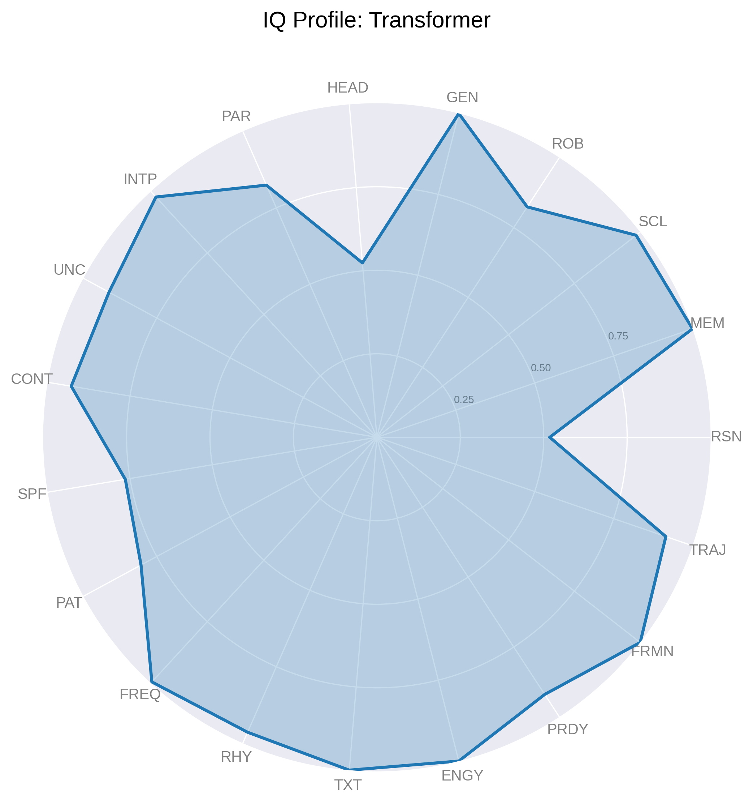
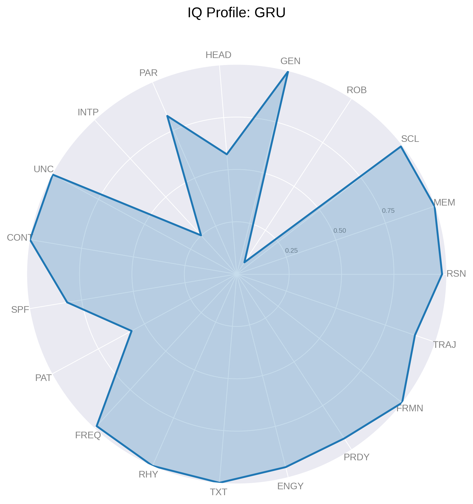
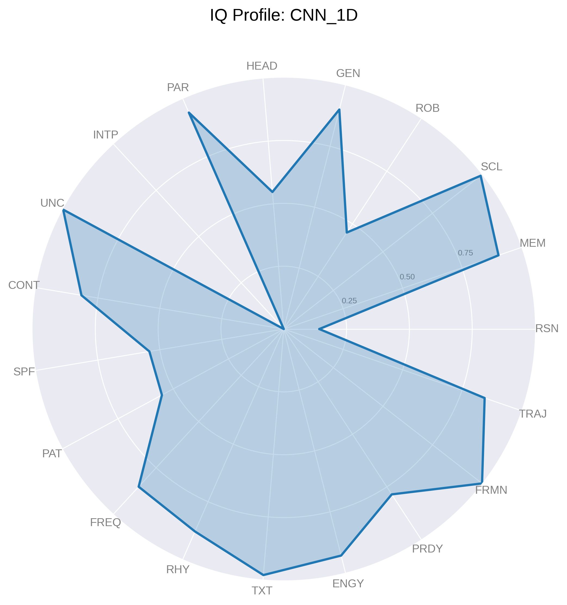

# IQ-NET: Holistic Aptitude Profiler for Neural Network Architectures

**IQ-NET** is a lightweight, rapid, and comprehensive framework for profiling the intrinsic capabilities of neural network architectures. Unlike traditional benchmarks like GLUE or ImageNet, which focus on single-task performance and require extensive GPU resources, IQ-NET evaluates models across 15 theoretically grounded metrics in minutes using synthetic probe tasks. It spans text, image, audio, and video domains, revealing each model's unique "personality profile" through vivid radar charts. This project empowers researchers to select task-optimal models, identify improvement areas, and drive architectural innovation.

The code evaluates five neural network models—**Zarvan**, **Transformer**, **GRU**, **LSTM**, and **1D-CNN**—across metrics like Reasoning (RSN), Memory (MEM), Scalability (SCL), Robustness (ROB), Generalization (GEN), and more. The results are visualized as individual and combined radar charts, saved as high-resolution PNG files.

## Features
- **Rapid Profiling**: Evaluates models in minutes using synthetic tasks, running on either CPU or GPU (CUDA).
- **Comprehensive Metrics**: Profiles 15 aptitudes, including:
  - **RSN**: Reasoning (stateful logical processing)
  - **MEM**: Memory (information recall)
  - **SCL**: Scalability (handling increasing sequence lengths)
  - **ROB**: Robustness (performance under noise)
  - **GEN**: Generalization (performance on unseen data)
  - **HEAD**: Learning Headroom (remaining learning potential)
  - **PAR**: Parameter Efficiency (fewer parameters)
  - **INTP**: Interpretability (focus on relevant inputs)
  - **UNC**: Uncertainty (appropriate uncertainty on ambiguous inputs)
  - **CONT**: Continual Learning (knowledge retention across tasks)
  - **SPF**: Spatial Focus (feature localization in images)
  - **PAT**: Pattern Invariance (recognition despite transformations)
  - **FREQ**: Frequency Detection (identifying frequencies in audio)
  - **RHY**: Rhythm Comprehension (classifying temporal patterns)
  - **TRAJ**: Trajectory Prediction (extrapolating object motion in videos)
- **Visualization**: Generates insightful radar charts for each model and a combined comparison.
- **Reproducible**: Includes seed setting for consistent results and synthetic datasets for bias-free evaluation.
- **Open Source**: All code and synthetic probe datasets follow FAIR data principles.

## Installation

### Prerequisites
- Python 3.8+
- pip (Python package manager)

### Dependencies
Install the required Python libraries using:
```bash
pip install torch numpy scipy pandas matplotlib opencv-python
````

**Note**: `opencv-python` is optional but highly recommended for the image and video probe tasks. If not installed, the script gracefully handles its absence with a fallback mechanism, which may slightly reduce the complexity of the visual probes.

### Clone the Repository

```bash
git clone [https://github.com/systbs/iq-net.git](https://github.com/systbs/iq-net.git)
cd iq-net
```

## Usage

1.  **Run the Profiler**:
    Execute the main script to profile the five models (Zarvan, Transformer, GRU, LSTM, CNN\_1D):

    ```bash
    python benchmark.py
    ```

    The script will:

      - Profile each model across the 15 metrics.
      - Output detailed logs to the console, including per-metric scores and sub-level accuracies.
      - Generate radar charts saved as PNG files in the project directory.

2.  **Output Files**:

      - **Individual Radar Charts**: `iq_profile_<model>.png` (e.g., `iq_profile_zarvan.png`).
      - **Combined Radar Chart**: `iq_net_radar_comparison.png`.
      - **Console Output**: A markdown-formatted table summarizing the results, including a weighted **Final IQ Score**.

## Results & Visualization

IQ-NET reveals distinct architectural "personalities," highlighting strengths and weaknesses that are not apparent from single-task benchmarks. The final scores show a clear hierarchy in holistic aptitude among the tested models.

### Final IQ-NET Report

The models are ranked below by their **Final IQ Score**, a weighted average of all 15 metrics designed to reflect a balanced, holistic aptitude.

| Metric                      |   Zarvan |   Transformer |     GRU |    LSTM |   CNN\_1D |
|:----------------------------|---------:|--------------:|--------:|--------:|---------:|
| Parameter\_Score             |   0.8892 |        0.9311 |  0.8407 |  0.8017 |   0.9497 |
| Scalability\_Score           |   0.9582 |        0.9857 |  0.9927 |  0.9931 |   0.9925 |
| Memory\_Score                |   1      |        1      |  0.9808 |  0.9586 |   0.8111 |
| Reasoning\_Score             |   0.7502 |        0.3388 |  0.6967 |  0.5434 |   0.137  |
| Generalization\_Score        |   1      |        1      |  0.9825 |  0.9608 |   0.8042 |
| Robustness\_Score            |   0.7631 |        0.8914 |  0.2427 |  0.3013 |   0.3822 |
| Learning\_Headroom           |   0.5252 |        0.5126 |  0.5374 |  0.5977 |   0.5265 |
| Interpretability\_Score      |   0.9617 |        0.9872 |  0.5054 |  0.2403 |   0.9983 |
| Uncertainty\_Score           |   0.9196 |        0.9473 |  0.9983 |  0.999  |   0.9966 |
| Continual\_Learning\_Score    |   0.8125 |        0.7027 |  1      |  0.9211 |   0.68   |
| Spatial\_Focus\_Score         |   0.5261 |        0.5064 |  0.4938 |  0.4947 |   0.5163 |
| Pattern\_Invariance\_Score    |   0.5681 |        0.5402 |  0.4777 |  0.5145 |   0.529  |
| Frequency\_Detection\_Score   |   0.9911 |        0.7232 |  0.2746 |  0.2701 |   0.7065 |
| Rhythm\_Comprehension\_Score  |   0.9777 |        0.6674 |  0.3069 |  0.3393 |   0.6518 |
| Trajectory\_Prediction\_Score |   0.6088 |        0.6088 |  0.6367 |  0.6248 |   0.6334 |
| **Final\_IQ\_Score** |  **81.77** |    **72.44** | **65.80** | **62.87** |  **62.75** |

### Key Insights:

  - **Zarvan** emerges as the top-performing model with a commanding **Final IQ Score of 81.77**. It demonstrates exceptional aptitude in high-level reasoning (`0.7502`), perfect memory and generalization, and near-perfect performance in audio comprehension tasks.
  - **Transformer** shows a strong profile, excelling in memory, generalization, and robustness. However, its significantly lower reasoning score (`0.3388`) compared to Zarvan and GRU highlights a key trade-off.
  - **GRU** and **LSTM** display classic RNN strengths. GRU, in particular, achieves a perfect score in Continual Learning (`1.0000`) and a high Reasoning score (`0.6967`). Both, however, struggle significantly with the audio frequency and rhythm tasks.
  - **CNN\_1D** shows a specialized profile. While it lags in abstract tasks like reasoning and memory, it achieves the highest scores in parameter efficiency and interpretability, making it a strong candidate for resource-constrained applications where model transparency is critical.

### Individual Model Profiles

| Zarvan Profile | Transformer Profile | GRU Profile |
| :---: | :---: | :---: |
|  |  |  |

| LSTM Profile | CNN_1D Profile |
| :---: | :---: |
|  |  |

## Methodology

IQ-NET uses synthetic probe tasks to evaluate models across four domains:

  - **Text**: Memory and reasoning tasks with synthetic sequences (vocab\_size=100, sequence\_length=128, num\_samples=1200).
  - **Image**: Spatial focus and pattern invariance tasks using 32x32 images.
  - **Audio**: Frequency detection and rhythm comprehension tasks with 2048-length signals.
  - **Video**: Trajectory prediction tasks using 16-frame 32x32 videos.

To ensure a fair comparison of the core architectures, standardized perception heads (a patch-based embedding layer for images and a frame-based embedding layer for audio) are used to convert multimodal data into sequences. This isolates the evaluation to the model's ability to process and reason with these sequences, rather than its built-in perceptual capabilities.

## Contributing

Contributions are welcome\! Please submit issues or pull requests for bug fixes, feature additions, or documentation improvements. Follow these steps:

1.  Fork the repository.
2.  Create a feature branch (`git checkout -b feature/your-feature`).
3.  Commit changes (`git commit -m "Add your feature"`).
4.  Push to the branch (`git push origin feature/your-feature`).
5.  Open a pull request.

## License

This project is licensed under the MIT License.

## Contact

For questions or feedback, contact Yasser Sajjadi at [yassersajjadi@gmail.com](mailto:yassersajjadi@gmail.com).

-----

*Built with ❤️ by Yasser Sajjadi, powered by synthetic probe tasks and a passion for unveiling neural network potential.*
